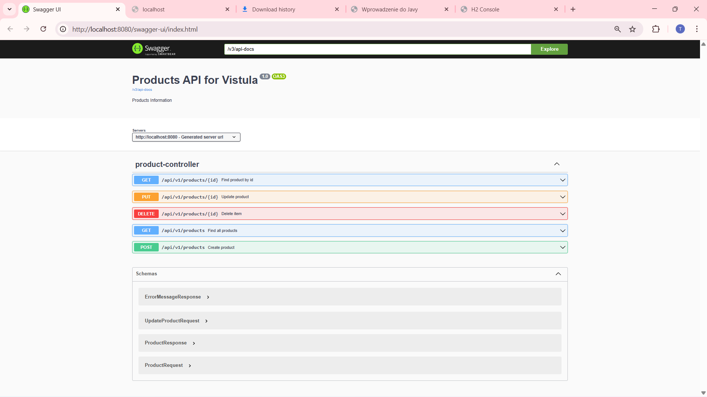
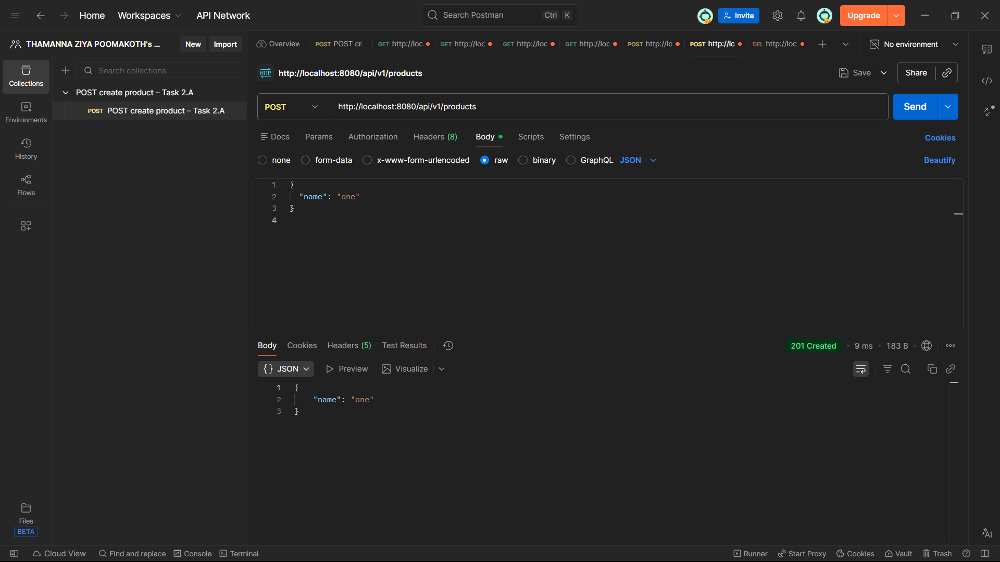
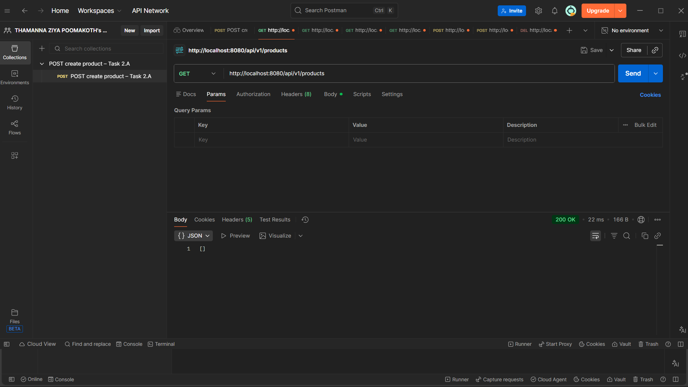
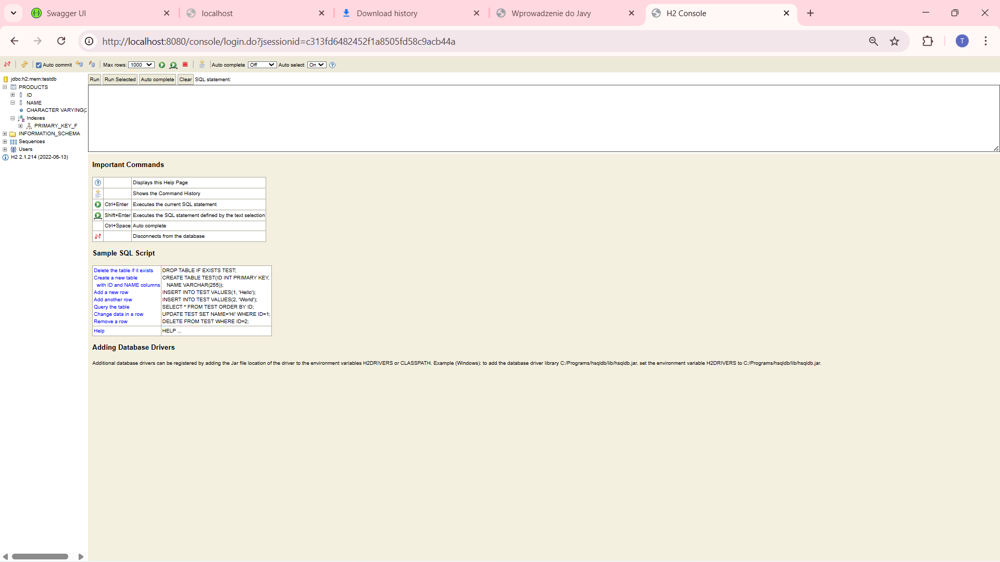
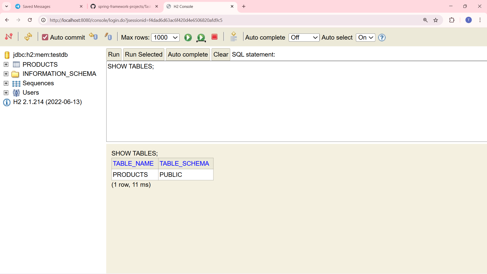
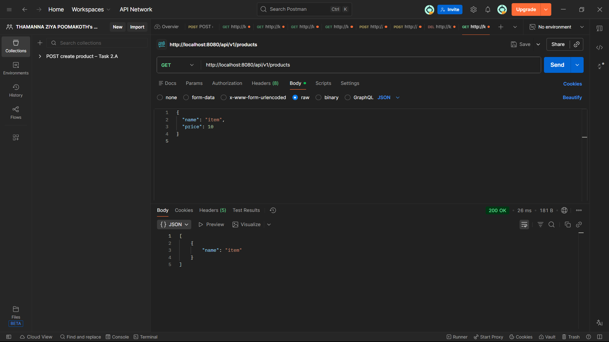
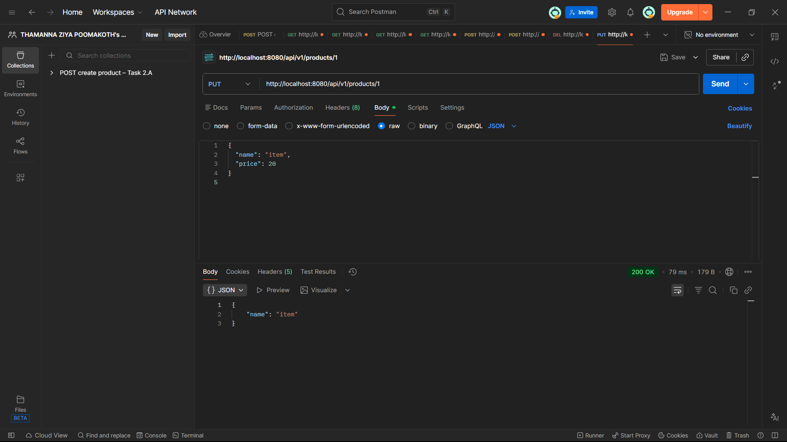
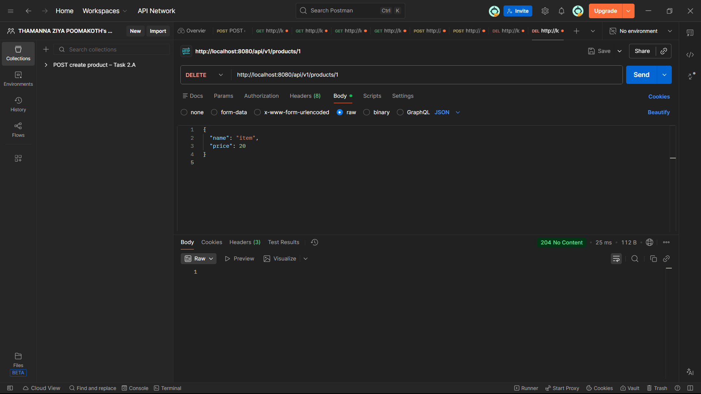

# Task 2 – FirstRestAPI (Spring Boot REST API)

## Description
This project is a REST API application created using Spring Boot.  
The application exposes CRUD endpoints for managing products and does not contain any frontend.

The project demonstrates:
- REST API principles
- Layered architecture (Controller, Service, Repository)
- Spring Data JPA
- H2 in-memory database
- Swagger (OpenAPI) documentation
- Exception handling

---

## Technologies Used
- Java 17
- Spring Boot
- Spring Web
- Spring Data JPA
- H2 Database
- Swagger (OpenAPI)
- Maven

---

## Project Structure
- **api** – REST controllers and request/response DTOs
- **domain** – domain model (Product entity)
- **service** – business logic
- **repository** – data access layer
- **support** – mappers and exception handling

---

## Available Endpoints

| Method | Endpoint | Description |
|------|---------|------------|
| POST | /api/v1/products | Create a new product |
| GET | /api/v1/products | Get all products |
| GET | /api/v1/products/{id} | Get product by ID |
| PUT | /api/v1/products/{id} | Update product |
| DELETE | /api/v1/products/{id} | Delete product |

---

## Database Query Execution

The H2 in-memory database was accessed using the built-in console.

Query:
SHOW TABLES;

Result:
(screenshot below)

## Use Cases and Functionalities

### Create (POST)

### Read (GET)

### Update (PUT)

### Delete (DELETE)

